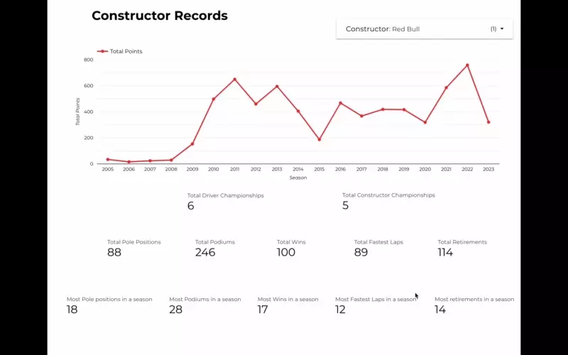

This project focuses on constructing a comprehensive and seamlessly integrated data pipeline. The primary objective is to retrieve the latest race information by using the [Ergast F1 Data](https://ergast.com/mrd/) and storing the obtained data in Google Cloud Storage. Subsequently, the data is processed by applying column filters, performing transformations, and then loaded into BigQuery. To enhance the dataset, DBT is leveraged to generate additional columns, tables and views. Finally Google Looker Studio is used to build dashboards on the top of the data for easy analysis.

### Project Components
The project consists of the following components:

- Infrastructure: Terraform is used to easily manage and setup infrastructure 
- Data Extraction: Data is extracted from the Ergast API, providing comprehensive race information.
- Data Storage: The extracted data is saved to Google Cloud Storage (GCS) for further processing.
- Data Loading: The transformed data is loaded into BigQuery for storage and querying.
- Orchestration: Prefect manages and monitors entire pipeline workflow, which are broken down into small tasks and flows.
- DBT Integration: DBT is utilized to derive new columns and maintain an up-to-date dataset.
- Data Visualization: The transformed data is visualized in a looker dashboard for easy analysis.

### Dashboard Demo
